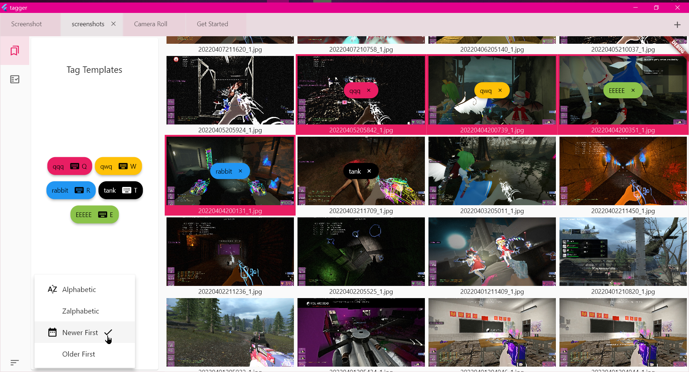
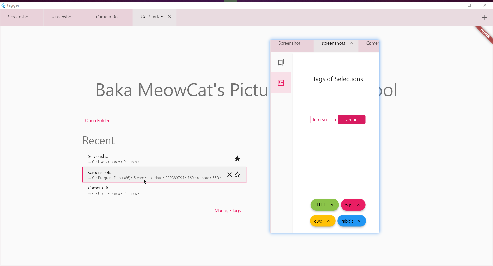

# Rbq2012Tagger

Quick tagging utility for local pictures built with Flutter.

Focuses on convenient tagging of local pictures from any folders, targeting PC and Android, featuring one-key shortcuts and keyboard navigation.

Currently still in progress. Not planning to update for the next month as my P0 demand is already fulfilled. If you somehow need it, download from the Releases section in the page or build and run it.

## Screenshots

## Roadmap

- [x] Core viewing functionalities (lazy grid, folder picker, sort by name/date asc/desc)
- [x] Welcome page (recent, pinned folders, ...)
- [x] centralized management for tag templates, shortcuts, and color schema (currently *broken* after refactoring)
- [x] Keyboard shortcuts and navigation (single-letter for tagging, alt/shift + letter for continuous/reverse tagging, arrows for navigation)
- [x] Displaying/managing tags (sqlite CRUD)
- [x] Explorer.exe-like Multiple selection ([ctrl/shift/alt +] click, ctrl/shift/alt + arrow)
- [x] VS Code-like multiple tabs (PC only)
- [x] VS Code-like side tabs for showing all available tag templates, and other functionalities, some listed below (switchable, resizable, collapsible, keep-state)
- [x] intersection/union of tags for selected pictures via side tab (viewing and removal)
- [x] Add comments so that at least I myself can read after a month or so
- [x] Reconnect the broken tag templates management (open from home page, open in new tab from any opened folder)
- [x] (P0, +++) Search and highlight (by name, range of date, included and/or excluded tags)
  - [ ] (P2, +) Save/load searches
- [x] (P1, +) Selection/search -based actions (move/copy to, add/remove tags)
- [ ] (P2, ++) ~~Advanced searching and actions using JavaScript~~ Python SDK is enough.
- [ ] (P2, ++++) Mobile adaptation (will be mainly used for pictures stored in the app's container):
  - [ ] (P2, ++) conditional/responsive UI
  - [ ] (P2, +) tapping and swapping instead of keystrokes
  - [ ] (P3, +) incremental import/export (backup/restore)
- [ ] (P3, +) Undo/redo stack
- [ ] (P3, ++) OCR and AI-based tagging via third-party APIs or inference models
